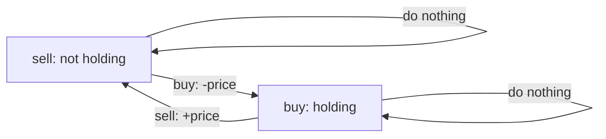
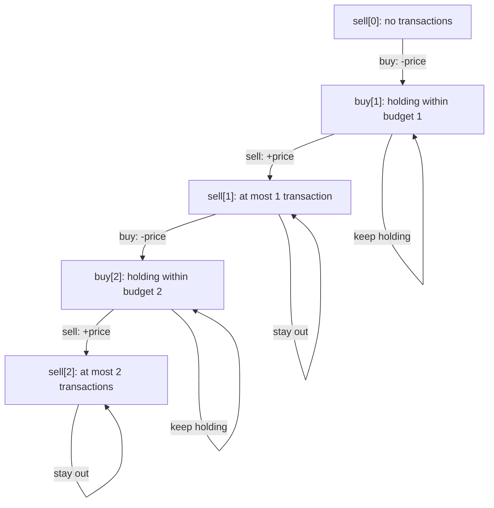
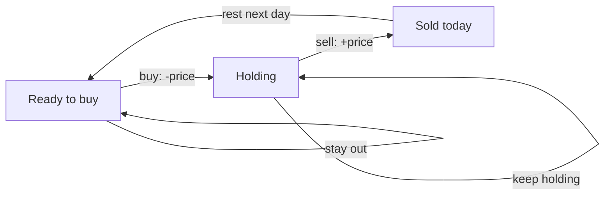

# Stock State Machine DP: `buy[t]` and `sell[t]`

Revision notes for **LC 121, 122, 123, 188, 309, and 714**, including a general template for at most `k` transactions.

> **Main idea:** After each day, keep the best cash balance for every legal state. `buy[t]` and `sell[t]` are state values, not instructions to buy or sell today.

## Contents

1. [The basic state machine](#1-the-basic-state-machine)
2. [What the state values mean](#2-what-the-state-values-mean)
3. [One consistent transaction convention](#3-one-consistent-transaction-convention)
4. [Deriving the transitions](#4-deriving-the-transitions)
5. [Initialization and the final answer](#5-initialization-and-the-final-answer)
6. [General `k`-transaction template](#6-general-k-transaction-template)
7. [Updating in place safely](#7-updating-in-place-safely)
8. [LC 121: one transaction](#8-lc-121-one-transaction)
9. [LC 122: unlimited transactions](#9-lc-122-unlimited-transactions)
10. [LC 123: at most two transactions](#10-lc-123-at-most-two-transactions)
11. [LC 188: at most `k` transactions](#11-lc-188-at-most-k-transactions)
12. [A complete worked example](#12-a-complete-worked-example)
13. [Why a holding state can have positive profit](#13-why-a-holding-state-can-have-positive-profit)
14. [Alternative convention: count completed sells](#14-alternative-convention-count-completed-sells)
15. [LC 309: cooldown](#15-lc-309-cooldown)
16. [LC 714: transaction fee](#16-lc-714-transaction-fee)
17. [Roadmap and problem mapping](#17-roadmap-and-problem-mapping)
18. [Generic state machine DP](#18-generic-state-machine-dp)
19. [Common mistakes](#19-common-mistakes)
20. [Final interview cheat sheet](#20-final-interview-cheat-sheet)

## 1. The basic state machine

On each day, you either:

- **Hold one share:** represented by a `buy` state.
- **Hold no shares:** represented by a `sell` state.

The legal actions are:

| Current state | Action | Next state | Change in cash balance |
| --- | --- | --- | --- |
| Not holding | Buy | Holding | `-price` |
| Holding | Sell | Not holding | `+price` |
| Not holding | Do nothing | Not holding | `0` |
| Holding | Do nothing | Holding | `0` |



The graph above applies to unlimited transactions. For a transaction limit, the state also records the transaction budget.

The useful question is:

> After processing today, what is the best cash balance I can have in each state?

This replaces trying every possible pair of buy and sell days.

## 2. What the state values mean

All state values include the cash effects of earlier actions:

```python
cash_balance = money_received_from_sells - money_spent_on_buys
```

While holding, the purchase price has already been subtracted. The share's current market value has **not** been added to the state value.

For example:

| Actions so far | Cash balance | State |
| --- | --- | --- |
| No actions | `0` | Not holding |
| Buy at `5` | `-5` | Holding |
| Buy at `5`, sell at `13` | `8` | Not holding |
| Then buy again at `5` | `3` | Holding |

Therefore:

- A `buy` state is the best balance **while currently holding**.
- A `sell` state is the best balance **while currently not holding**.
- A state can keep its old value by doing nothing.
- The final answer comes from a non-holding state because profit must be realized by selling.

## 3. One consistent transaction convention

One transaction consists of **one buy followed by one sell**. You may hold at most one share at a time.

For the main template, use `t` as a **transaction budget**. Reserve one transaction slot when buying.

| Array entry | Exact meaning after processing the current day |
| --- | --- |
| `sell[t]` | Maximum balance while not holding, after **at most `t` completed transactions** |
| `buy[t]` | Maximum balance while holding, after **at most `t` purchases**, with at most `t - 1` completed transactions |

The open purchase in `buy[t]` occupies one of the `t` transaction slots. Selling it finishes that transaction without changing the index.

The important transitions are:

| Action | From | To |
| --- | --- | --- |
| Start a transaction using one additional slot | `sell[t - 1]` | `buy[t]` |
| Finish the open transaction within the same budget | `buy[t]` | `sell[t]` |

For `k = 2`:



The budgets mean **at most**, so reaching `sell[2]` does not require making exactly two trades. A strategy using fewer trades is allowed there too.

## 4. Deriving the transitions

Let today's price be `price`. Let `prev_buy` and `prev_sell` contain **yesterday's** values.

### Entering `buy[t]`

There are two possibilities:

1. Keep the share held yesterday: `prev_buy[t]`.
2. Buy today after a strategy with at most `t - 1` completed transactions: `prev_sell[t - 1] - price`.

```python
buy[t] = max(
    prev_buy[t],                    # Keep holding.
    prev_sell[t - 1] - price        # Buy today.
)
```

The `t - 1` appears because buying reserves the next transaction slot.

### Entering `sell[t]`

Again, there are two possibilities:

1. Stay out of the market: `prev_sell[t]`.
2. Sell the share held yesterday within budget `t`: `prev_buy[t] + price`.

```python
sell[t] = max(
    prev_sell[t],                   # Stay out.
    prev_buy[t] + price             # Sell today.
)
```

### The entire recurrence

```python
buy[t] = max(prev_buy[t], prev_sell[t - 1] - price)
sell[t] = max(prev_sell[t], prev_buy[t] + price)
```

Each `max` compares **doing nothing** with **taking the action that enters this state**.

If you include the day explicitly, the same recurrence is:

```python
buy[day][t] = max(buy[day - 1][t], sell[day - 1][t - 1] - price)
sell[day][t] = max(sell[day - 1][t], buy[day - 1][t] + price)
```

Only yesterday's row is needed, so the day dimension can be removed.

## 5. Initialization and the final answer

Before processing any prices:

```python
buy = [float("-inf")] * (k + 1)
sell = [0] * (k + 1)
```

Why?

| Entry | Initial value | Reason |
| --- | --- | --- |
| `sell[0]` | `0` | With zero transactions, do nothing |
| `sell[t]` for `t >= 1` | `0` | With at most `t` transactions, doing nothing is allowed |
| `buy[t]` for `t >= 1` | `-inf` | Holding a share before any day has been processed is impossible |
| `buy[0]` | `-inf` | Buying with a zero transaction budget is impossible |

Never update `buy[0]`. Keep `sell[0] = 0`.

The answer is:

```python
return sell[k]
```

`sell[k]` already includes strategies with fewer than `k` transactions. You do not need `max(sell)` with this convention.

> **At most versus exactly:** Initializing every `sell[t]` to zero is correct for an **at-most** budget. For an **exact-count** state, all positive transaction counts must initially be unreachable.

## 6. General `k`-transaction template

This version uses copies to make every transition explicitly depend on yesterday. It is the easiest version to reason about first.

```python
from typing import List


def max_profit_k(prices: List[int], k: int) -> int:
    if not prices or k <= 0:
        return 0

    buy = [float("-inf")] * (k + 1)
    sell = [0] * (k + 1)

    for price in prices:
        prev_buy = buy[:]
        prev_sell = sell[:]

        for t in range(1, k + 1):
            buy[t] = max(
                prev_buy[t],
                prev_sell[t - 1] - price
            )

            sell[t] = max(
                prev_sell[t],
                prev_buy[t] + price
            )

    return sell[k]
```

**Time:** `O(nk)`, where `n = len(prices)`.

**Auxiliary space:** `O(k)`, including the two previous-day copies.

The copies do not change the asymptotic space complexity.

## 7. Updating in place safely

You can remove the copies by using two ordering rules:

1. Process `t` in **descending order**.
2. Update `sell[t]` **before** `buy[t]`.

```python
from typing import List


def max_profit_k_in_place(prices: List[int], k: int) -> int:
    if not prices or k <= 0:
        return 0

    buy = [float("-inf")] * (k + 1)
    sell = [0] * (k + 1)

    for price in prices:
        for t in range(k, 0, -1):
            sell[t] = max(sell[t], buy[t] + price)
            buy[t] = max(buy[t], sell[t - 1] - price)

    return sell[k]
```

Why this order preserves yesterday's values:

| Update | Required old value | Why it is still old |
| --- | --- | --- |
| `sell[t]` | `buy[t]` | `buy[t]` has not been updated yet |
| `buy[t]` | `sell[t - 1]` | Descending order has not reached `t - 1` yet |

**Time:** `O(nk)`. **Auxiliary space:** `O(k)`.

### What about the common ascending version?

You may also see:

```python
for price in prices:
    for t in range(1, k + 1):
        buy[t] = max(buy[t], sell[t - 1] - price)
        sell[t] = max(sell[t], buy[t] + price)
```

This can reuse values updated on the same day. For the basic at-most-`k` problem, the answer remains correct: buying and selling at the same price creates no additional profit, and a same-day sell followed by a buy can be removed without reducing profit.

However, it is not literally the previous-day recurrence. Use the copy-based version or the descending, sell-first version when learning the pattern or adapting it to other constraints.

## 8. LC 121: one transaction

**Problem:** Best Time to Buy and Sell Stock.

Set `k = 1`.

Since `sell[0] = 0`, buying becomes:

```python
buy[1] = max(prev_buy[1], sell[0] - price)
# Equivalent to:
buy[1] = max(prev_buy[1], -price)
```

The selling transition remains:

```python
sell[1] = max(prev_sell[1], prev_buy[1] + price)
```

### Python solution

```python
from typing import List


class Solution:
    def maxProfit(self, prices: List[int]) -> int:
        buy = [float("-inf")] * 2
        sell = [0] * 2

        for price in prices:
            # Sell first so this reads yesterday's buy[1].
            sell[1] = max(sell[1], buy[1] + price)
            buy[1] = max(buy[1], sell[0] - price)

        return sell[1]
```

**Time:** `O(n)`. **Auxiliary space:** `O(1)`.

**Critical distinction:** Buying must use `sell[0]`, not `sell[1]`. Using `sell[1] - price` would allow reinvesting the first transaction's profit into further transactions.

`buy[1]` is the negative of the lowest price seen so far. Selling tests the profit from that cheapest earlier purchase.

## 9. LC 122: unlimited transactions

**Problem:** Best Time to Buy and Sell Stock II.

There is no transaction-count restriction, so all holding states can be merged, and all non-holding states can be merged.

To keep the requested array notation, use `buy[1]` and `sell[1]` for the two states. **Here, index `1` is just a fixed state slot; it does not mean a one-transaction budget.** Index `0` is unused in this unlimited form.

Now a new purchase can reuse the profit from any previous sales:

```python
buy[1] = max(prev_buy[1], prev_sell[1] - price)
sell[1] = max(prev_sell[1], prev_buy[1] + price)
```

Compare the buy transitions:

| Problem | Buy transition | Meaning |
| --- | --- | --- |
| LC 121 | `sell[0] - price` | Buy using only the initial zero balance |
| LC 122 | `prev_sell[1] - price` | Buy again using profit from earlier transactions |

### Python solution

```python
from typing import List


class Solution:
    def maxProfit(self, prices: List[int]) -> int:
        buy = [float("-inf")] * 2
        sell = [0] * 2

        for price in prices:
            prev_buy = buy[1]
            prev_sell = sell[1]

            buy[1] = max(prev_buy, prev_sell - price)
            sell[1] = max(prev_sell, prev_buy + price)

        return sell[1]
```

**Time:** `O(n)`. **Auxiliary space:** `O(1)`.

For this basic unlimited variant, adding every positive consecutive-day price increase is also optimal. The state-machine solution is easier to adapt when a fee or cooldown is added.

## 10. LC 123: at most two transactions

**Problem:** Best Time to Buy and Sell Stock III.

Set `k = 2`. The four useful state entries are:

| State | Meaning |
| --- | --- |
| `buy[1]` | Holding with a budget of one transaction |
| `sell[1]` | Not holding after at most one transaction |
| `buy[2]` | Holding with a budget of two transactions |
| `sell[2]` | Not holding after at most two transactions |

The transitions are:

```python
buy[1] = max(prev_buy[1], sell[0] - price)
sell[1] = max(prev_sell[1], prev_buy[1] + price)

buy[2] = max(prev_buy[2], prev_sell[1] - price)
sell[2] = max(prev_sell[2], prev_buy[2] + price)
```

### Python solution

```python
from typing import List


class Solution:
    def maxProfit(self, prices: List[int]) -> int:
        buy = [float("-inf")] * 3
        sell = [0] * 3

        for price in prices:
            # Second transaction budget first.
            sell[2] = max(sell[2], buy[2] + price)
            buy[2] = max(buy[2], sell[1] - price)

            # First transaction budget second.
            sell[1] = max(sell[1], buy[1] + price)
            buy[1] = max(buy[1], sell[0] - price)

        return sell[2]
```

This is exactly the descending general template with the `t = 2` and `t = 1` updates written out.

**Time:** `O(n)`. **Auxiliary space:** `O(1)` because there are a fixed number of entries.

## 11. LC 188: at most `k` transactions

**Problem:** Best Time to Buy and Sell Stock IV.

The general template handles this directly. There is one useful optimization: when `k >= n // 2`, the transaction limit cannot reduce the optimal profit.

Why `n // 2`?

- Any useful transaction can be represented by a buy day followed by a later sell day.
- A same-day sell followed by a buy can be merged into one continuous holding period without changing profit.
- After removing those redundant actions, at most `floor(n / 2)` buy/sell pairs are needed over `n` days.

Therefore, for a sufficiently large `k`, use the unlimited two-state version.

### Complete optimized Python solution

```python
from typing import List


class Solution:
    def maxProfit(self, k: int, prices: List[int]) -> int:
        n = len(prices)

        if n < 2 or k <= 0:
            return 0

        if k >= n // 2:
            # Unlimited form: index 1 is a fixed state slot.
            buy = [float("-inf")] * 2
            sell = [0] * 2

            for price in prices:
                prev_buy = buy[1]
                prev_sell = sell[1]

                buy[1] = max(prev_buy, prev_sell - price)
                sell[1] = max(prev_sell, prev_buy + price)

            return sell[1]

        # Limited form: t is the transaction budget.
        buy = [float("-inf")] * (k + 1)
        sell = [0] * (k + 1)

        for price in prices:
            for t in range(k, 0, -1):
                sell[t] = max(sell[t], buy[t] + price)
                buy[t] = max(buy[t], sell[t - 1] - price)

        return sell[k]
```

| Branch | Time | Auxiliary space |
| --- | --- | --- |
| `0 < k < n // 2` | `O(nk)` | `O(k)` |
| `k >= n // 2` | `O(n)` | `O(1)` |
| Fewer than two days or zero budget | `O(1)` | `O(1)` |

## 12. A complete worked example

```python
prices = [3, 2, 6, 5, 0, 3]
k = 2
```

Using the previous-day recurrence gives:

| Day | Price | `buy[1]` | `sell[1]` | `buy[2]` | `sell[2]` |
| --- | --- | --- | --- | --- | --- |
| Before day 0 | — | `-inf` | `0` | `-inf` | `0` |
| 0 | `3` | `-3` | `0` | `-3` | `0` |
| 1 | `2` | `-2` | `0` | `-2` | `0` |
| 2 | `6` | `-2` | `4` | `-2` | `4` |
| 3 | `5` | `-2` | `4` | `-1` | `4` |
| 4 | `0` | `0` | `4` | `4` | `4` |
| 5 | `3` | `0` | `4` | `4` | `7` |

The best two-transaction strategy is:

1. Buy at `2`, sell at `6`: profit `4`.
2. Buy at `0`, sell at `3`: profit `3`.

Total profit: `sell[2] = 7`.

### The important update on day 4

```python
buy[2] = max(previous_buy_2, previous_sell_1 - 0)
# = max(-1, 4 - 0)
# = 4
```

The first completed transaction earned `4`. Buying the next share at `0` leaves the cash balance at `4` while holding.

On day 5:

```python
sell[2] = max(previous_sell_2, previous_buy_2 + 3)
# = max(4, 4 + 3)
# = 7
```

### Why is `buy[2]` reachable before two trades have occurred?

Because it means holding **within a budget of two transactions**, not holding after exactly the second purchase.

On day 0, buying one share at `3` is allowed under either budget 1 or budget 2. Therefore both `buy[1]` and `buy[2]` can equal `-3`.

## 13. Why a holding state can have positive profit

Consider:

```python
prev_sell[1] = 8
price = 5
```

The candidate for buying another share is:

```python
buy_candidate = prev_sell[1] - price  # 8 - 5 = 3
```

This means:

> Earlier completed transactions earned `8`. After spending `5` to buy the currently held share, the cash balance is `3`.

It does not mean the share cost `3`, or that you sold it for a profit of `3`.

If you later sell it for `7`, the resulting non-holding balance is:

```python
new_sell_balance = 3 + 7  # 10
```

Equivalently:

```python
new_sell_balance = previous_profit + (7 - 5)  # 8 + 2 = 10
```

This is why `buy[t]` may be positive. The state carries the entire trading history's cash balance.

## 14. Alternative convention: count completed sells

Some solutions count completed transactions instead of reserving a slot at purchase time. Both conventions are valid, but their indices differ.

**This section changes the definition of `t`.** Keep it separate from the main template.

Define:

| Entry | Meaning |
| --- | --- |
| `sell[t]` | Best balance while not holding after **exactly `t` completed sells** |
| `buy[t]` | Best balance while holding after **exactly `t` completed sells** |

Now:

- Buying keeps the number of completed sells unchanged.
- Selling increases the number of completed sells by one.

The recurrence becomes:

```python
buy[t] = max(prev_buy[t], prev_sell[t] - price)
sell[t] = max(prev_sell[t], prev_buy[t - 1] + price)  # t >= 1
```

### Initialization

```python
buy = [float("-inf")] * k
sell = [float("-inf")] * (k + 1)
sell[0] = 0
```

`buy[t]` only needs indices `0` through `k - 1`. Buying after already completing `k` transactions would start a transaction you cannot finish within the limit.

Because these are exact-count states, positive sell counts are initially impossible.

### Python solution using this alternative convention

```python
from typing import List


def max_profit_completed_sells(prices: List[int], k: int) -> int:
    if not prices or k <= 0:
        return 0

    buy = [float("-inf")] * k
    sell = [float("-inf")] * (k + 1)
    sell[0] = 0

    for price in prices:
        prev_buy = buy[:]
        prev_sell = sell[:]

        for t in range(k):
            buy[t] = max(prev_buy[t], prev_sell[t] - price)

        for t in range(1, k + 1):
            sell[t] = max(prev_sell[t], prev_buy[t - 1] + price)

    # At most k transactions: choose among the exact-count states.
    return max(sell)
```

**Time:** `O(nk)`. **Auxiliary space:** `O(k)`.

### The conventions side by side

| Convention | Buy transition | Sell transition | Initial non-holding values | Answer |
| --- | --- | --- | --- | --- |
| Main: at-most budget, slot reserved on buy | `prev_sell[t - 1] - price` | `prev_buy[t] + price` | All `sell[t] = 0` | `sell[k]` |
| Alternative: exact completed-sell count | `prev_sell[t] - price` | `prev_buy[t - 1] + price` | Only `sell[0] = 0`; others `-inf` | `max(sell)` |

**Revision rule:** Pick one convention and keep its definitions, initialization, recurrence, and final answer together. The main template is the one to memorize.

## 15. LC 309: cooldown

**Problem:** Best Time to Buy and Sell Stock with Cooldown.

After selling on day `i`, you cannot buy on day `i + 1`. You can buy again on day `i + 2`.

An explicit state machine has three states:

- **Holding:** a share is currently owned.
- **Sold today:** the next day must be a cooldown day.
- **Ready:** no share is owned, and buying is allowed.



Every edge advances one day. There is no direct edge from **Sold today** to **Holding**.

### Keep two arrays by remembering an older `sell` value

As in the unlimited variant, index `1` is a fixed state slot rather than a transaction count:

| Entry | Meaning |
| --- | --- |
| `buy[1]` | Best balance while holding |
| `sell[1]` | Best balance while not holding, including both ready and cooldown cases |

Selling is unchanged. Buying must use the non-holding result from **two days earlier**:

```python
buy_today = max(buy_yesterday, sell_two_days_ago - price)
sell_today = max(sell_yesterday, buy_yesterday + price)
```

Why two days earlier? Any strategy already not holding at the end of day `i - 2` is eligible to buy on day `i`, even if its most recent sale occurred on day `i - 2`. Day `i - 1` supplies the cooldown.

### Python solution

```python
from typing import List


class Solution:
    def maxProfit(self, prices: List[int]) -> int:
        buy = [float("-inf")] * 2
        sell = [0] * 2
        sell_two_days_ago = 0

        for price in prices:
            prev_buy = buy[1]
            prev_sell = sell[1]

            buy[1] = max(prev_buy, sell_two_days_ago - price)
            sell[1] = max(prev_sell, prev_buy + price)

            # Advance the older balance for the next day's iteration.
            sell_two_days_ago = prev_sell

        return sell[1]
```

**Time:** `O(n)`. **Auxiliary space:** `O(1)`.

Example: `prices = [1, 2, 3, 0, 2]` gives `3`:

1. Buy at `1`, sell at `2`.
2. Cool down on the day priced `3`.
3. Buy at `0`, sell at `2`.

**Key change:** Replace yesterday's non-holding balance in the buy transition with the balance from two days earlier.

## 16. LC 714: transaction fee

**Problem:** Best Time to Buy and Sell Stock with Transaction Fee.

Transactions are unlimited. Charge the fee exactly once per completed transaction.

Again, index `1` is a fixed holding/non-holding state slot.

If the fee is charged on selling:

```python
buy[1] = max(prev_buy[1], prev_sell[1] - price)
sell[1] = max(prev_sell[1], prev_buy[1] + price - fee)
```

### Python solution

```python
from typing import List


class Solution:
    def maxProfit(self, prices: List[int], fee: int) -> int:
        buy = [float("-inf")] * 2
        sell = [0] * 2

        for price in prices:
            prev_buy = buy[1]
            prev_sell = sell[1]

            buy[1] = max(prev_buy, prev_sell - price)
            sell[1] = max(prev_sell, prev_buy + price - fee)

        return sell[1]
```

**Time:** `O(n)`. **Auxiliary space:** `O(1)`.

Example: `prices = [1, 3, 2, 8, 4, 9]`, `fee = 2` gives `8`:

- Buy at `1`, sell at `8`: `8 - 1 - 2 = 5`.
- Buy at `4`, sell at `9`: `9 - 4 - 2 = 3`.

You can instead charge the fee on buying:

```python
buy[1] = max(prev_buy[1], prev_sell[1] - price - fee)
sell[1] = max(prev_sell[1], prev_buy[1] + price)
```

Either placement is valid. Do not subtract it on both actions.

For a limited-`k` variant with a fee, preserve the main transaction-budget recurrence and change only the sale reward:

```python
buy[t] = max(prev_buy[t], prev_sell[t - 1] - price)
sell[t] = max(prev_sell[t], prev_buy[t] + price - fee)
```

## 17. Roadmap and problem mapping

| Problem | Constraint | Main idea | Time | Auxiliary space |
| --- | --- | --- | --- | --- |
| **LC 121** — Best Time to Buy and Sell Stock | At most one transaction | Buy from `sell[0] = 0` | `O(n)` | `O(1)` |
| **LC 122** — Best Time to Buy and Sell Stock II | Unlimited transactions | Merge transaction-count states | `O(n)` | `O(1)` |
| **LC 123** — Best Time to Buy and Sell Stock III | At most two transactions | Keep `buy[1:3]` and `sell[1:3]` | `O(n)` | `O(1)` |
| **LC 188** — Best Time to Buy and Sell Stock IV | At most `k` transactions | Use the general budget template | `O(nk)`; `O(n)` for unlimited branch | `O(k)`; `O(1)` for unlimited branch |
| **LC 309** — Best Time to Buy and Sell Stock with Cooldown | One-day cooldown after selling | Buy from the result two days earlier | `O(n)` | `O(1)` |
| **LC 714** — Best Time to Buy and Sell Stock with Transaction Fee | Fee per transaction | Subtract the fee once | `O(n)` | `O(1)` |

Suggested learning order:

1. **121:** understand holding versus not holding and why the first buy uses zero.
2. **122:** understand how selling profit funds another purchase.
3. **123:** make transaction budgets visible with four state entries.
4. **188:** replace the two fixed budgets with a loop over `t`.
5. **714:** change an edge's reward.
6. **309:** change which earlier states are eligible to buy.

For a focused first pass, solve **121 → 188 → 714 → 309**. Use 122 and 123 as stepping stones when the generalization needs more practice.

## 18. Generic state machine DP

State machine DP is ordinary dynamic programming organized around **legal states and transitions**.

The workflow is:

1. Identify the states needed to decide which actions are legal.
2. Define what the best value in each state means.
3. Draw or list the legal transitions.
4. Attach each transition's reward or cost.
5. Initialize reachable and impossible states.
6. Process the sequence, taking the best way to enter each state.
7. Return the best legal finishing state.

For stocks:

| General component | Stock interpretation |
| --- | --- |
| Sequence item | Today's price |
| State | Holding status, transaction budget, and any extra restriction |
| Transition | Buy, sell, or do nothing |
| Reward or cost | `-price`, `+price`, and possibly `-fee` |
| Aggregation | `max` |
| Impossible state | `-inf` |
| Legal final state | Not holding |

An abstract recurrence is:

```python
best_today[state] = max(
    best_yesterday[previous_state] + transition_reward
    for previous_state in legal_predecessors[state]
)
```

This is pseudocode. In the stock template, the two concrete arrays are `buy` and `sell`, and each state has only two incoming choices.

The day dimension records progress through the input. The state dimensions record the information about earlier decisions that can affect future choices.

## 19. Common mistakes

| Mistake | Correction |
| --- | --- |
| Treating `buy[t]` as the share's purchase price | It is the best cash balance while holding |
| Treating `sell[t]` as “must sell today” | It includes doing nothing while already not holding |
| Mixing budget-on-buy and completed-sell counting | Keep each convention's indices and initialization together |
| Saying an at-most state has exactly `t` completed trades | Define it as a budget; fewer trades are allowed |
| Initializing a holding state to zero | Use `-inf` before any prices are processed |
| Using `sell[1] - price` for LC 121 | Use `sell[0] - price` so a second trade is impossible |
| Returning a holding state's value | Return the legal non-holding result |
| Assuming any in-place update order uses yesterday's values | Use snapshots, or descending `t` with sell before buy |
| Using the unlimited buy recurrence for cooldown | Use the non-holding result from two days earlier |
| Charging the fee on both buy and sell | Charge it exactly once per transaction |
| Expecting `buy[2]` to be impossible before two buys | In the main template it means holding within budget 2 |

## 20. Final interview cheat sheet

### State definitions for at most `k` transactions

```python
# sell[t]: best balance while not holding,
#          after at most t completed transactions.
#
# buy[t]:  best balance while holding,
#          with at most t purchases and at most t - 1 completed transactions.
#
# Buying reserves the next transaction slot.
```

### Initialize

```python
buy = [float("-inf")] * (k + 1)
sell = [0] * (k + 1)

# buy[0] stays impossible; sell[0] stays zero.
```

### Transitions using yesterday's values

```python
buy[t] = max(prev_buy[t], prev_sell[t - 1] - price)
sell[t] = max(prev_sell[t], prev_buy[t] + price)
```

### Template to memorize

```python
from typing import List


def max_profit(prices: List[int], k: int) -> int:
    if not prices or k <= 0:
        return 0

    buy = [float("-inf")] * (k + 1)
    sell = [0] * (k + 1)

    for price in prices:
        for t in range(k, 0, -1):
            # Read yesterday's buy[t] before updating it.
            sell[t] = max(sell[t], buy[t] + price)

            # Descending order leaves sell[t - 1] at yesterday's value.
            buy[t] = max(buy[t], sell[t - 1] - price)

    return sell[k]
```

**Time:** `O(nk)`. **Auxiliary space:** `O(k)`.

### Recognize the variations

| Variant | Change |
| --- | --- |
| One transaction | Set `k = 1`; buy only from zero |
| Two transactions | Set `k = 2` |
| Arbitrary transaction limit | Loop over `t = 1..k` |
| Unlimited transactions | Use one holding slot and one non-holding slot; buy from yesterday's non-holding balance |
| Transaction fee | Subtract `fee` once, usually on selling |
| Cooldown | Buy from the non-holding balance two days earlier |

> **Remember:** Buy enters a holding state by subtracting the price. Sell enters a non-holding state by adding the price. The transaction definition determines which array index supplies the previous balance.
